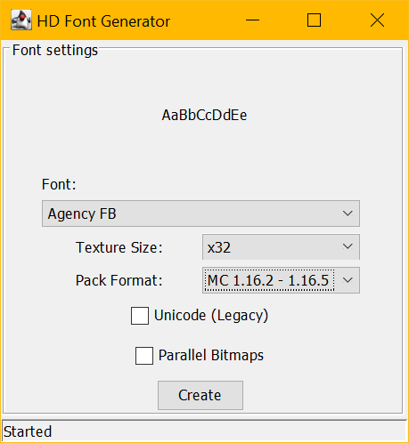

# HD Font Generator

This tool creates HD font resource packs using installed fonts on the system. If
it's supported and installed in your computer, you can use it.

To use, select the font and texture size from the dropdown boxes and click
Create. A zip named using the font name and the size will be created in the
directory it was started from. Add this file as a resource pack.

For command line usage, just give it a font name with spaces replaced with
underscores, then the texture. A nonexistent font will use the JRE default
(dialog.plain).

Note: Every font is different, so some may look weird and require tweaking after
generation, but most fonts should be fine.

## Options

Different options can be customized before generation. These include:

- **Font**: The font family to use, pre-populated from system fonts.
- **Texture Size**: The size of the texture. Limited to one of x32, x64, x128,
  x256, x512. Higher resolution textures will take longer to generate
- **Pack Format**: The minecraft version range to generate the font for.
  Supports formats 1 through 7.
- **Unicode**: (legacy), Generates the full extended unicode, which consists of
  256 pages, each with 256 characters. Fallback font uses the 
  [gnu uniform font](http://unifoundry.com/unifont/).
- **Parallel**: Uses multiple threads to generate font bitmaps in parallel.